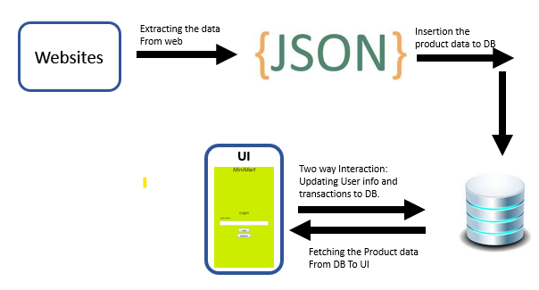
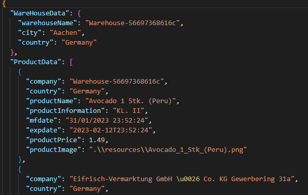
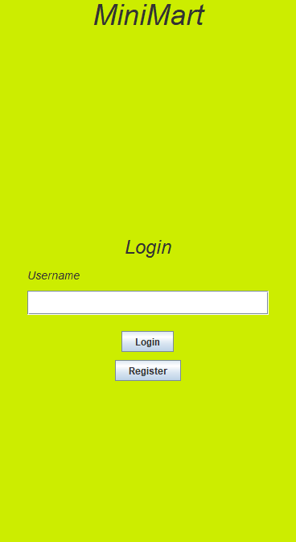
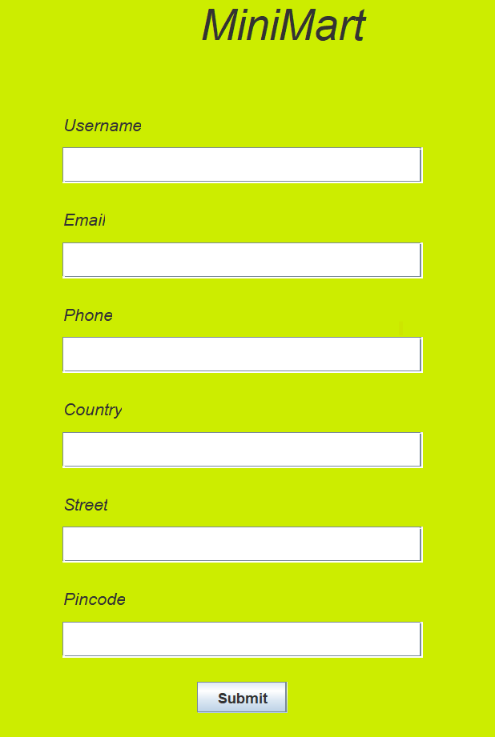
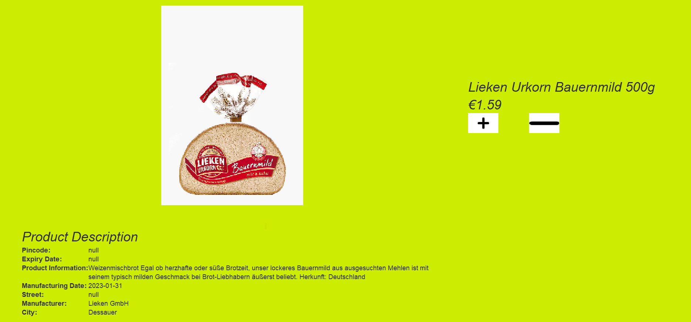

# GroceryDeliverySystem
The Project is done to strengthen the understanding of programming 
concepts but also build real-time application maintenance that can 
revolutionize the world! That's precisely what this project aims to 
achieve. With the help of cutting-edge tools like Java, Maven, SQL, 
JDBC (mysql driver), Swing, and jsoup, this project 
is poised to imprint its mark on the world of technology

## Overview
The basic idea of the project is to extract the products data from the websites 
and transform it into accessible json format and store the data into database and create a 
user-friendly UI where user can select wide range of products. Here, the registered user data 
is stored in the DB and each transaction that user does is also updated to the DB.

  Fig 1. Project Structure

## Working
1. Initially, I have extracted the various products data from the web from the input config using the 
jsoup dependency and exposed the extracted data into the json file.

  Fig 2. Product Json

2. Secondly, I have inserted the data in the json to the database in respective tables

  Fig 3. Database Schema

3. I have created an interactive and user-friendly UI where users can 
login/Register with their email address and add the products they want
to the cart and checkout.

The structure of the UI design as follows:
3.1. Creation of Login Page:
  Fig 3.1. UI Login Page 

3.2. If the user does not exist in the database then login page is 
directed to registration page.
  Fig 3.2. UI Registration Page 

3.3. After user has successfully logged in then large variety of products
are displayed and user can add the required products to the cart.
  Fig 3.3. UI Products Display Page

3.4. When user selects a particular product a dedicated product window pops
up where user can find the detailed description of the product and can add
required quantity to the cart.
  Fig 3.4. UI Product Information Page

3.5. After selection of the required products the user can check out by clicking
the cart button where user can review the products selected and exit from the application

## Future Scope
Initially, This project is done to practise the codding skills and getting to 
know working of the eCommerce applications. As further development for this 
project a web api could be created which can be used to add the products to the DB,
new features such as search bar, menu, password for login in the UI can be added,
the transaction data can be used to conduct a detailed market analysis, and so on.

## Conclusion
Through this project, I've not only enhanced my understanding of Object-Oriented Principles and database management principles but have also mastered the art of build automation tools like Maven. 
Furthermore, I've gained hands-on experience in data handling. This 
project has given me an invaluable opportunity to peek behind 
the curtain and 
get a firsthand view of how large eCommerce companies operate. 